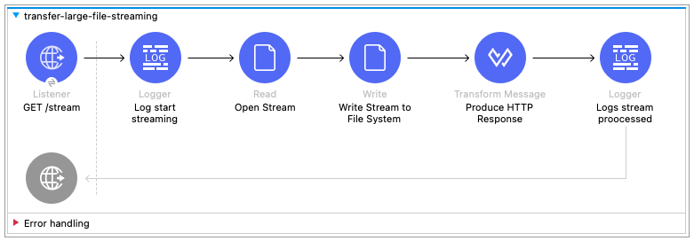

# Mule Streaming: Large files over file systems
Example on how to stream a large file and process it within a mule app

This project aims to illustrate how to process large files that exceed the memory/RAM/Heap space available. The app will "process" one large file by reading it as a stream and write it to disk to a different folder location.

## Getting Started

1. Import this code as a Mule project to Anypoint Studio.

2. Configure the properties that define the location of the source & destination folders (src/main/resources/configuration.properties)
3. Set the Mule App Run Arguments (JVM Arguments), as follows:
```
-Xmx512M
-Xms512M 
```

 	> Forces mule app to have 512MB of Heap/Memory available, so the CSV file exceeds the space.

## Sample Data
Download zip archive under https://www3.stats.govt.nz/2018census/Age-sex-by-ethnic-group-grouped-total-responses-census-usually-resident-population-counts-2006-2013-2018-Censuses-RC-TA-SA2-DHB.zip

Use the data.csv file, 857MB of size, place it within the origin directory to be processed.


## Run the Mule App
Import the source code as a mule project in the Anypoint Studio.
Deploy the application locally at the Studio.
Trigger the stream by sending a HTTP GET request to ```http://localhost:8081/stream```

Compare the source and destination folders.


Analyze the results, and memory consumption, for example Visual VM or any other JVM profiler could help you.


### Further Reading & References
- https://docs.mulesoft.com/mule-runtime/4.4/streaming-about
- Another streaming blog: https://medium.com/another-integration-blog/streaming-in-mule-ac573c8b5019
- More on HTTP-based streaming: https://gist.github.com/CMCDragonkai/6bfade6431e9ffb7fe88
